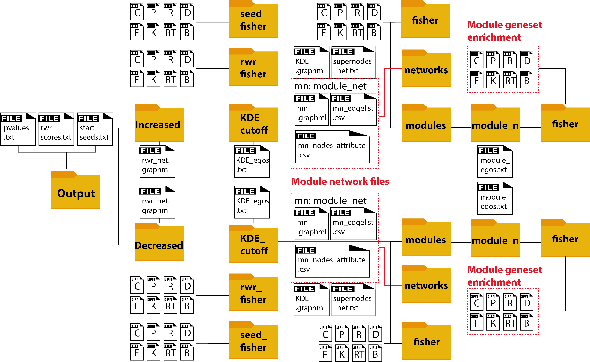

Output
======

Overview
~~~~~~~~

Phuego output numerous files generated at each steps of the algorithm,
organized into a folder structure. The diagram below shows the folder structure,
highlighting in red the key output of phuEGO. 
(**TODO**: in future update, option will be added to turn off the verbose output) 
If the user prefers to navigate the files without the deep folder structure, 
they could use the flag **–dont_convert2folder**.

In brief, a user input protein list (seeds) is divided into two
directions using signs of the scores. On each direction, it is
expanded through network propagation into a very large list (rwr). Then
this list is narrowed down (depending on where the user set the
KDE_cutoff) by extracting only Ego network of seed nodes (ego), and
further filtered and clustered by keeping inter-linked egos (modules).

Final results: module networks
~~~~~~~~~~~~~~~~~~~~~~~~~~~~~~

The module network files highlighted in red are the final output of phuEGO. 
They contain a network that constitutes of all the modules. There are three files
in /direction/KDE_cutoff/networks/:

.. code-block::

   - module_net.graphml
   - module_net_edgelist.csv
   - module_net_nodes_attribute.csv

The first file is a network file that can directly be imported into Cytoscape or other 
network visualization/analysis software. Different formats can be provided through the 
**-nf** parameter, but the default .graphml format contains information for module annotation.
To aid downstream analysis, phuEGO also export annotated edgelist and 
nodes list as .csv file.

Conceptually, the modules resemble a canonical signalling "pathway". Geneset over-representation analysis
is performed for the protein list of each module separately to annotate the module function (/direction/KDE_cutoff/modules/module_n/fisher/). 
By comparing this with the test result of the seeds (in /seed_fisher), the user can examine whether phuEGO indeed boosts the signal from the seeds. 
The geneset database are
part of the supporting database. In total, 8 databases are included, and
one or more databases can be specified by providing abbreviation to the
**–fg** parameter.

.. code-block::

   -P: enrichment against Gene Ontology biological process. Output file: Pfisher.txt
   -F: enrichment against Gene Ontology functional . Output file: Ffisher.txt
   -C: enrichment against Gene Ontology cellular component. Output file: Cfisher.txt
   -K: enrichment against KEGG. Output file: Kfisher.txt
   -R: enrichment against Reactome when only the leaves are consider as annotation. Output file: Rfisher.txt
   -RT: enrichment against Reactome when all the hierarchy is considered. Output file: RTfisher.txt
   -D: enrichment against DisGenenet. Output file: Dfisher.txt
   -B: enrichment against Bioplanet. Output file: Bfisher.txt

Intermediate results
~~~~~~~~~~~~~~~~~~~~

Results of the seeds network propagation are stored on the top layer of the result folder. These
files can be reused by phuEGO to save time, when the user provide the flag **-ru** to CLI.

.. code-block::

   - pvalues.txt
   - rwr_scores.txt
   - start_seeds.txt

The pvalues.txt file contains the pvalues for each node of the network.
It is divided in seven columns, the first column refers to the uniprot
ids.

Columns from 2,3,and 4 refers to the pvalues associated with the
increased phosphorylation nodes pvalues, of which: -second column refers
to the pvalues when increased phosphorilated tyrosine are used as seed
nodes -third column refers to the pvalues when all the other increased
phosphorilated kinases are used as seed nodes, -fourth column refers to
the pvalues when the increased phosphorilated substrates are used as
seed nodes.

Columns from 5,6 and 7 refers to the pvalues associated with the
decreased phosphorylated nodes pvalues, of which: -fifth column refers
to the pvalues when decreased phosphorilated tyrosine are used as seed
nodes -sixt column refers to the pvalues when all the other decreased
phosphorilated kinases are used as seed nodes, -seventh column refers to
the pvalues when the decreased phosphorilated substrates are used as
seed nodes.

A value greater than 950 indicates a pvalues<0.05 as well as a values
greater than 990 indicates a pvalues<0.01.

The rwr_scores.txt file has the same format of pvalues.txt with the
difference that values indicates rwr scores.
The start_seeds.txt is basically the same as the user input.

Network files of the seeds propagation and after ego decomposition are exported at:

.. code-block::

   - decreased/rwr_net.graphml
   - increased/rwr_net.graphml
   - decreased/KDE_cutoff/networks/KDE.graphml
   - increased/KDE_cutoff/networks/KDE.graphml

On the ego level, a text file summarize the protein list within ego
network of each seed on a separate row. The first column is a seed node,
the remaining column are the neighbors associated with the seed nodes.
If **-ie** is provided to CLI, then rows with only the seeds will be
excluded during network generation.

.. code-block::

   - decreased/KDE_cutoff/KDE_egos.txt
   - increased/KDE_cutoff/KDE_egos.txt

On the module level, for each module, a similar text file is generated,
containing only module-specific seeds and the associated nodes.

.. code-block::

   - decreased/KDE_cutoff/modules/module_N/module_egos.txt
   - increased/KDE_cutoff/modules/module_N/module_egos.txt